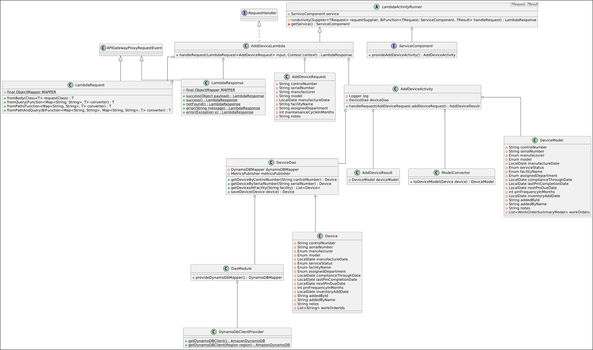

# HTM Vault

## 1. Problem Statement

"HTM Vault" is a medical device service documentation system used to store a detailed inventory of devices for a given medical facility, along with records of work performed on each device.

"HTM Vault" will assist Healthcare Technology Management service providers in maintaining an accurate, up-to-date list of devices under contract, allowing them to keep track of preventive maintenance due dates and whether a device is in compliance or not, among other features. Additionally, records of work performed will provide the ability to detail the results of initial acceptance testing, preventive maintenance, and/or repairs for a given device.

## 2. Use Cases

U1. As a user, I want to add a medical device to an inventory, including device identifiers (i.e. control sticker number, serial number, manufacturer, and model), assigned location (facility and department), and details of the device's preventative maintenance status (i.e. PM frequency, last PM date, and next PM due date). Note: Last PM date, next PM due date, and compliance status to auto-update upon closing of PM work order, based on specified completion date and PM frequency.

U2. As a user, I want to update an active medical device's inventory record to correct any errors or provide new information (i.e. correct the serial number, or change the assigned department).

U3. As a user, I want to inactivate/retire a medical device in the inventory (soft delete), in the event that it has been taken out of service by the facility/customer (i.e. if it has been replaced with newer technology, or if it was a rental device that has now been returned, etc.), so that I can still view related information, but will know that it does not actively need routine preventative maintenance performed. Note: any open work orders for the device must first be closed.

U4. As a user, I want to reactivate a medical device in the inventory, in the event that it has been returned to service (i.e. it was a previous rental and is being rented again).

U5. As a user, I want to retrieve a device's inventory record by its control sticker number or serial number.

U6. As a user, I want to view a medical device's inventory record, including its PM compliance status (i.e. the last PM date, the next PM due date, and whether it is past due or not), as well as a summary view of the list of work orders attached to it, sorted by completion date (ascending or descending). The summary work order view will contain the work order id, the work order type, the completion status, the date created, and the completion date/time, if applicable. Note: open work orders without a completion date time to show up first in a list sorted in descending order.

U7. As a user, I want to view a list of medical devices at a facility, sorted by control sticker number (ascending or descending), showing manufacturer/model, assigned department, and the PM due date.

U8. As a user, I want to view a list of active medical devices at a facility, matching a specific department, sorted by control number (ascending or descending), showing manufacturer/model, assigned department, and the PM due date.

U9. As a user, I want to view a list of active medical devices at a facility, matching a specific manufacturer and model, sorted by control number (ascending or descending), showing manufacturer/model, assigned department, and the PM due date.

U10. As a user, I want to view a list of active, past due medical devices at a facility, sorted by control number (ascending or descending), showing manufacturer/model, assigned department, and the PM due date.

U11. As a user, I want to view a list of active medical devices at a facility due for PM in the current month, sorted by control number (ascending or descending), showing manufacturer/model, assigned department, and the PM due date.

U12. As a user, I want to view a list of active medical devices at a facility due for PM next month, sorted by control number (ascending or descending), showing manufacturer/model, assigned department, and the PM due date.

U13. As a user, I want to create a new work order for an active medical device, in order to document the related maintenance activity (i.e. initial acceptance testing, preventative maintenance, and repairs), including details of the technician(s) involved, the device, the problem reported, the problem diagnosis, the current status (i.e. awaiting parts), and the work performed (i.e. actions and testing).

U14. As a user, I want to view a work order, including a list of its labor entries (sorted by entry ID), parts replaced entries (sorted by entry ID), and test equipment used entries (sorted by equipment ID).

U15. As a user, I want to update an existing work order while it is in an open/ongoing status (i.e. it was created, the initial diagnosis was performed and documented, and parts have been ordered; then, several days later the parts arrived and repairs were completed/documented, before finally closing the work order).

U16. As a user, I want to add labor entries to an open work order, including technician ID/name, start and end dates/times, and notes. Additionally, the total time for the labor entry should be auto-calculated and populated, based on the start and end dates/times.

U17. As a user, I want to update/correct the start and end date/time for a labor entry on an open work order.

U18. As a user, I want to view a labor entry on a work order.

U19. As a user, I want to delete a labor entry on an open work order (i.e. if a duplicate entry was added in error).

U20. As a user, I want to add a part replaced to an open work order, including part ID, description, and quantity.

U21. As a user, I want to update a 'part replaced' entry on an open work order (i.e. to correct the quantity or the part)

U22. As a user, I want to view a 'part replaced' entry on a work order.

U23. As a user, I want to delete a 'part replaced' entry on an open work order (i.e. if it was added in error).

U24. As a user, I want to add a test device used to an open work order, including its identifiers and compliance status (i.e. the manufacturer, model, serial number, and ID of an electrical safety tester, along with a 'compliance through date' of January 2024, at which point it will need to be checked for accuracy before it can continue to be used)

U25. As a user, I want to delete a 'test device used' entry from an open work order (i.e. if it was added in error).

U26. As a user, I want to complete/close a work order so that it can no longer be modified and becomes a permanent record.

## 3. Out of Scope / Stretch Goals

- Billing details/integration (i.e. device coverage levels, such as 'full service with parts', or 'preventive maintenance no parts', which dictate rules for what labor and parts are billable/non-billable, along with applicable fields within a work order and labor/part entries)
- Electronic customer signatures for work orders
- Printer friendly formatting (i.e. of inventory records, inventory lists, work orders)
- Sorting facility inventory lists by manufacturer/model or department
- Device RFID locators and current precise location information/integration
- Viewing a list of inactive/retired devices (note: individual inactive devices can be viewed)
- Inventory record end-of-life information as dictated by a device manufacturer (i.e. date the device no longer supported by the manufacturer, potentially meaning repair parts can no longer be acquired, manufacturer technical support and/or documentation no longer provided, customer notification needed so they can plan/budget for replacement, etc.)
- Integration of work order with patient incident investigation workflows (i.e. when device involved in patient harm)
- Retirement reasons (i.e. device lost/stolen, rental returned, etc.)
- Auto-generating acceptance testing work orders (i.e. upon addition of device to inventory or upon reactivating an existing retired device)
- Auto-generating PM work orders (i.e. when a PM is due)
- Listing or sorting inventory by device type (i.e. IV pumps)
- Listing open work orders
- Administrative features/access (i.e. adding new facilities, departments, or manufacturers/models, etc.)
- Numerical tracking of a device's failure count (i.e. number of work orders with a type of 'repair', as opposed to a PM or Acceptance work order)
- Parts ordering system integration
- Adding new manufacturers/models to select from when adding new device
- Adding test devices to select from when adding to work order

## 4. Proposed Architecture Overview

## 5. API

### 5.1 Public Models
```
// DeviceModel

String controlNumber;
String serialNumber;
Enum manufacturer;
Enum model;
LocalDate manufactureDate;
Enum serviceStatus;
Enum facilityName;
Enum assignedDepartment;
LocalDate complianceThroughDate;
LocalDate lastPmCompletionDate;
LocalDate nextPmDueDate;
Enum pmFrequencyInMonths;
String inventoryAddDate;
String addedByID;
String addedByName;
String notes;
List<WorkOrderSummaryModel> workOrders;
```

```
// WorkOrderModel

String workOrderId;
Enum workOrderType;
Enum completionStatus;
Enum awaitStatus;
String controlNumber;
String serialNumber;
Enum manufacturer;
Enum model;
Enum facilityName;
Enum assignedDepartment;
String createdById;
String createdByName;
LocalDateTime dateTimeCreated;
String closedById;
String closedByName;
LocalDateTime dateTimeClosed;
String problemReported;
String problemFound;
List<PerformanceCheckModel> checklist;
String summary;
LocalDateTime completionDateTime;
List<LaborSummaryModel> laborEntries;
List<PartSummaryModel> partsUsed;
List<TestDeviceSummaryModel> testDevicesUsed;
```

```
// WorkOrderSummaryModel

String workOrderId;
Enum workOrderType;
Enum completionStatus
LocalDateTime dateTimeCreated;
LocalDateTime completionDateTime;
```

```
// LaborModel

String entryId;
String workOrderId;
String employeeId;
String employeeName;
LocalDateTime startDateTime;
LocalDateTime endDateTime;
Double totalTime;
String notes;
```

```
// LaborSummaryModel

String entryId;
String employeeId;
LocalDateTime startDateTime;
LocalDateTime endDateTime;
Double totalTime;
```

```
// PartModel

String entryId;
String workOrderId;
Enum partNumber;
Enum partDescription;
int quantity;
```

```
// PartSummaryModel

String entryId;
Enum partNumber;
int quantity;
```

```
// TestDeviceModel

Enum deviceId;
String serialNumber;
Enum manufacturer;
Enum model;
LocalDate lastAccuracyCheck;
LocalDate nextDueAccuracyCheck;
boolean inCompliance;
```

```
// TestDeviceSummaryModel

Enum deviceId;
Enum manufacturer;
Enum model;
```

```
// PerformanceCheckModel

String description;
String limit;
String result;
boolean isComplete;
```

### 5.2 Add Device Endpoint
- Accepts ```POST``` request to ```/devices```
- Accepts data to create a new device and add it to the inventory, with the following information provided in the request body:
  - control number (numeric characters only)
  - serial number (alphanumeric characters and dashes only)
  - manufacturer
  - model
  - date of manufacture (optional)
  - facility name
  - assigned department
  - maintenance frequency (whole numbers only)
  - notes (optional)
- Returns the new device inventory record, including an empty list of work orders, the compliance through date, the last PM completion date, the next PM due date, the service status, the add date, as well as the id and name of the person that added it
- We will confirm the non-optional fields provided are not empty and have the correct format; additionally, we will confirm the date of manufacture, if provided, has the correct format (YYYY-MM-DD)
  - If the data provided does not meet these requirements, an ```InvalidAttributeValueException``` will be thrown

### 5.3 Update Device Endpoint
- Accepts ```PUT``` request to ```/devices/controlNumber```
  - If the device is not found, a ```DeviceRecordNotFoundException``` will be thrown
- Accepts data to update a device in the inventory, with the following information provided in the request body:
  - control number (numeric characters only)
  - serial number (alphanumeric characters and dashes only)
  - manufacturer
  - model
  - date of manufacture (optional)
  - facility name
  - assigned department
  - maintenance frequency (whole numbers only)
  - notes (optional)
- Returns the updated device inventory record, including the updated compliance through date and the next PM due date, if the maintenance frequency has changed
- We will confirm the provided non-optional fields are not empty and have the correct format; additionally, we will confirm the date of manufacture, if provided, has the correct format (YYYY-MM-DD)
  - If the data provided does not meet these requirements, an ```InvalidAttributeValueException``` will be thrown
- We will also confirm the device has a service status of "In Service" before allowing changes
  - If the device's service status is "Retired", a ```DeviceRetiredException``` will be thrown

### 5.4 Inactivate Device Endpoint
- Accepts ```DELETE``` request to ```/devices/controlNumber```
  - If the device is not found, a ```DeviceRecordNotFoundException``` will be thrown
- Returns the updated device inventory record, with a service status of "Retired"
- We will confirm that there are no work orders in the device's list that have a status of "Open".
  - If any of the device's work orders are open, an ```OpenWorkOrderExistsException``` will be thrown

### 5.5 Reactivate Device Endpoint
- Accepts ```PUT``` request to ```/devices/reactivate/controlNumber```
  - If the device is not found, a ```DeviceRecordNotFoundException``` will be thrown
- Returns the updated device inventory record, with a service status of "In Service"

### 5.6 Retrieve Device By Control Number Endpoint
- Accepts ```GET``` request to ```/devices/controlNumber```
  - If the device is not found, a ```DeviceRecordNotFoundException``` will be thrown
- Returns the device record for this control number

### 5.7 Retrieve Device By Serial Number Endpoint
- Accepts ```GET``` request to ```/devices/serialNumber```
  - If the device is not found, a ```DeviceRecordNotFoundException``` will be thrown
- Returns the device record for this serial number

### 5.8 View Devices At Facility Endpoint
- Accepts ```GET``` request to ```/devices/facility/sort```
- Returns a list of device records for this facility, sorted by control number in the order specified (ascending or descending)
  - If no sort order provided, defaults to ascending

### 5.9 View Devices At Facility In Department Endpoint
- Accepts ```GET``` request to ```/devices/facility/department/sort```
- Returns a list of device records for this facility, matching the specified department, and sorted by control number in the order specified (ascending or descending)
  - If no sort order provided, defaults to ascending

### 5.10 View Devices At Facility With Manufacturer And Model Endpoint
- Accepts ```GET``` request to ```/devices/facility/manufacturer/model/sort```
- Returns a list of device records for this facility, matching the specified manufacturer and model, sorted by control number in the order specified (ascending or descending)
  - If no sort order provided, defaults to ascending

### 5.11 View Past Due Devices At Facility Endpoint
- Accepts ```GET``` request to ```/devices/facility/pastdue/sort```
- Returns a list of device records for this facility, with a past due PM (prior to current month), sorted by control number in the order specified (ascending or descending)
  - If no sort order provided, defaults to ascending

### 5.12 View Devices At Facility Due In Current Month Endpoint
- Accepts ```GET``` request to ```/devices/facility/duethismonth/sort```
- Returns a list of device records for this facility, with a PM due in the current month, sorted by control number in the order specified (ascending or descending)
  - If no sort order provided, defaults to ascending

### 5.13 View Devices At Facility Due Next Month Endpoint
- Accepts ```GET``` request to ```/devices/facility/duenextmonth/sort```
- Returns a list of device records for this facility, with a PM due next month, sorted by control number in the order specified (ascending or descending)
  - If no sort order provided, defaults to ascending

### 5.14 Create Work Order Endpoint
- Accepts ```POST``` request to ```/workOrders```
- Accepts data to create a new work order for the specified device and adds it to the device's list of work orders, as well as the work_orders table, with the following information provided in the request body:
  - work order type (Acceptance Testing, Preventative Maintenance, Repair)
  - control number (numeric characters only)
  - problem reported
  - problem found (optional at creation)
- Returns the new work order record, including a unique work order id, an "open" completion status, an empty await status, device information including control number, serial number, manufacturer, model, facility name, and assigned department, the ID and name of the technician that created it, the creation date, an empty summary, a performance checklist, empty lists of labor entries, parts used, and test devices used.
- We will confirm the non-optional fields provided are not empty and have the correct format
  - If the control number entered is not found, a ```DeviceRecordNotFoundException``` will be thrown
  - If the data provided does not meet these requirements, an ```InvalidAttributeValueException``` will be thrown

### 5.15 View Work Order Endpoint
- Accepts ```GET``` request to ```/workOrders/workOrderId```
- Returns the work order record specified by the work order id
  - If no work order found, a ```WorkOrderNotFoundException``` will be thrown

### 5.16 Update Work Order Endpoint
- Accepts ```PUT``` request to ```/workOrders/workOrderId```
- Accepts data to update a work order in the work_orders table, with the following information provided in the request body:
  - await status
  - problem reported
  - problem found
  - summary
  - completion date and time
- Returns the updated work order record.
- We will confirm the non-optional fields provided are not empty and have the correct format
  - If the data provided does not meet these requirements, an ```InvalidAttributeValueException``` will be thrown
  - If the work order completion status is "closed", a ```WorkOrderClosedException``` will be thrown

### 5.17 Add Labor To Work Order Endpoint
- Accepts ```POST``` request to ```/workOrders/workOrderId/addLabor```
- Accepts data to create a new labor entry and add it to an open work order, including the start and end dates and times, as well as optional notes. Generates and adds an entry ID, the employee ID and name, and calculates/populates the total time for the labor based on the inputs.
- We will confirm the non-optional fields provided are not empty and have the correct format
  - If the data provided does not meet these requirements, an ```InvalidAttributeValueException``` will be thrown
  - If the work order completion status is "closed", a ```WorkOrderClosedException``` will be thrown

### 5.18 Edit Work Order Labor Entry Endpoint
- Accepts ```PUT``` request to ```/labor/entryId```
- Accepts data to update a labor entry, including the start and end dates and times, as well as optional notes. Updates the total time for labor based on the updated inputs.
- We will confirm the non-optional fields provided are not empty and have the correct format
  - If the data provided does not meet these requirements, an ```InvalidAttributeValueException``` will be thrown
  - If the work order completion status is "closed", a ```WorkOrderClosedException``` will be thrown

### 5.19 View Work Order Labor Entry Endpoint
- Accepts ```GET``` request to ```/labor/entryId```
- Returns the labor entry record for this entryId
  - If the labor entry is not found, a ```LaborEntryNotFoundException``` will be thrown

### 5.20 Delete Work Order Labor Entry Endpoint
- Accepts ```DELETE``` request to ```/labor/entryId```
- Removes the labor entry from the associated work order
  - If the work order completion status is "closed", a ```WorkOrderClosedException``` will be thrown
  - If the labor entry is not found, a ```LaborEntryNotFoundException``` will be thrown

### 5.21 Add Part Replaced To Work Order Endpoint
- Accepts ```POST``` request to ```/workOrders/workOrderId/parts```
- Accepts data to create a new part entry and add it to an open work order, including the part number, description, and quantity.
- We will confirm the non-optional fields provided are not empty and have the correct format
  - If the data provided does not meet these requirements, an ```InvalidAttributeValueException``` will be thrown
  - If the work order completion status is "closed", a ```WorkOrderClosedException``` will be thrown

### 5.22 Update Part Replaced Endpoint
- Accepts ```PUT``` request to ```/parts/entryId```
- Accepts data to update a part entry, including the part number, description, and quantity.
- We will confirm the non-optional fields provided are not empty and have the correct format
  - If the data provided does not meet these requirements, an ```InvalidAttributeValueException``` will be thrown
  - If the work order completion status is "closed", a ```WorkOrderClosedException``` will be thrown

### 5.23 View Part Replaced Endpoint
- Accepts ```GET``` request to ```/parts/entryId```
- Returns the part replaced entry record for this entryId
- If the part replaced entry is not found, a ```PartReplacedEntryNotFoundException``` will be thrown

### 5.24 Delete Part Replaced Endpoint
- Accepts ```DELETE``` request to ```/parts/entryId```
- Removes the part replaced entry from the associated work order
  - If the work order completion status is "closed", a ```WorkOrderClosedException``` will be thrown

### 5.25 Add Test Device To Work Order Endpoint
- Accepts ```POST``` request to ```/workOrders/workOrderId/testDevices```
- Accepts data to add a test device to an open work order with the test device ID. The manufacturer and model will be populated based on the provided ID.
- We will confirm the non-optional fields provided are not empty and have the correct format
  - If the data provided does not meet these requirements, an ```InvalidAttributeValueException``` will be thrown
  - If the work order completion status is "closed", a ```WorkOrderClosedException``` will be thrown
  - If the test device is not found, a ```TestDeviceNotFoundException``` will be thrown

### 5.26 Delete Test Device From Work Order Endpoint
- Accepts ```DELETE``` request to ```/workOrders/workOrderId/testDevices/id```
- Removes the test device used from the work order specified

### 5.27 Close Work Order Endpoint
- Accepts ```PUT``` request to ```/workOrders/close/workOrderId```
- Returns the updated work order record, with a completion status of "closed"
  - If the required fields are not complete, a "WorkOrderNotCompleteException" will be thrown

## 6. Tables

### 6.1 `devices`

```
controlNumber // partition key, string
serialNumber // string
manufacturer // string
model // string
manufactureDate // string
serviceStatus // string
facilityName // string
assignedDepartment // string
complianceThroughDate // string
lastPmCompletionDate // string
nextPmDueDate // string
pmFrequencyInMonths // number
inventoryAddDate // string
addedById // string
addedByName // string
notes // string
workOrders // string list
```

- ```FacilityNameAndAssignedDepartmentIndex``` includes control number, manufacturer, model, assignedDepartment, and nextPmDueDate
- ```FacilityNameAndManufacturerModelIndex``` includes includes control number, manufacturer, model, assignedDepartment, and nextPmDueDate
- ```FacilityNameAndPmDueDate``` includes control number, manufacturer, model, assignedDepartment, and nextPmDueDate

### 6.2 `work_orders`

```
workOrderId // string, partition key
workOrderType // string
completionStatus // string
awaitStatus // string
controlNumber // string
serialNumber // string
manufacturer // string
model // string
facilityName // string
assignedDepartment // string
createdById // string
createdByName // string
dateTimeCreated // string
closedById // string
closedByName // string
dateTimeClosed // string
problemReported // string
problemFound // string
summary // string
completionDateTime // string
laborEntries // string list
partsUsed // string list
testDevicesUsed // string list
```

### 6.3 `labor_entries`

```
entryId // string, partition key
workOrderId // string
employeeId // string
employeeName // string
startDateTime // string
endDateTime // string
totalTime // number
notes // string
```

### 6.4 `parts_replaced`

```
entryId // string, partition key
workOrderId // string
partNumber // string
partDescription // string
quantity // number
```

### 6.5 `test_equipment`

```
deviceId // string, partition key
serialNumber // string
manufacturer // string
model // string
lastAccuracyCheck // string
nextDueAccuracyCheck // string
inCompliance // boolean
```

### 6.6 `manufacturer_models`

```
manufacturer // string, partition key
models // string list
```

## 7. UML Class Diagram

### 7.1 Add Device


## 8. Front-end Mockups
